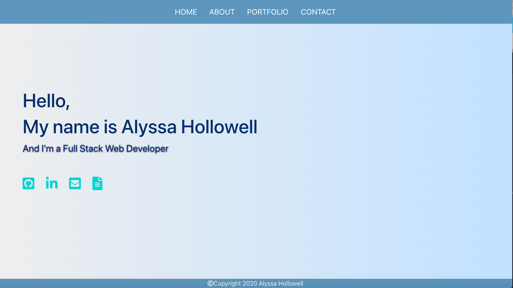

# React portfolio

# Created by Alyssa Hollowell

This application was bootstrapped with [Create React App](https://github.com/facebook/create-react-app).

## Available Scripts

In the application directory, you can run:

### `npm start`

Runs the app in the development mode.
Open [http://localhost:3000](http://localhost:3000) to view it in the browser.

The page will reload if you make edits.
You will also see any lint errors in the console.

# Description
This is my current portfolio which includes six of my projects, information about myself, a contact page, github link, linkedin link and my resume. My portfolio was built with React.js, Bootstrap, CSS and HTML.

# Application Link
https://alyssah1.github.io/React-portfolio/

# Questions 

If you have any questions please use the contacts down below:

Email address: alyssa.hollowell2@gmail.com

GitHub account: alyssah1

